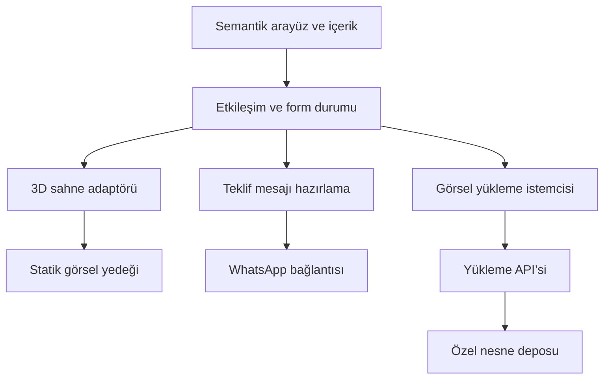

# ZY Reklam — Mimari

**Sürüm:** 1.2 · **Tarih:** 2026-10-01 · **Durum:** P2 ön yüz temeli doğrulandı; P3 gerçek 3D bekliyor

**İlgili belgeler:** [Yol haritası](ROADMAP.md) · [Çalışma kuralları](AGENTS.md)

## 1. Amaç ve mevcut durum

ZY Reklam web sitesi bir **dijital üretim atölyesi** olarak tasarlanacaktır. Ziyaretçi üretim kabiliyetini görür, gerçek işleri inceler, kendi tabela fikrini dener ve anlaşılır bir teklif talebi oluşturur.

GitHub deposu `akinarslan/zy_reklam`, 1 Ekim 2026 tarihinde boş olarak doğrulanmıştır. Bu belge hedef mimariyi ve doğrulanmış uygulama durumunu ayrı tutar. P2 temeli uygulanmıştır; P3–P9 özellikleri hedeftir. Mevcut kod, iletişim ve varlıklar incelendi; canlı yayın erişimi henüz doğrulanmadı. Kullanıcının aynı gün belirlediği logo PNG’si `public/assets/brand/zy-reklam-reference.png` yoluna alınmıştır. Mevcut kaynaklar `akinarslan/adex-reklam-demo` deposunun `497677a411e8e229333152b7474a1d5f34eb6152` commit’inden `legacy/` altına değişmeden alındı. Yatay vektör logo ve Citadel WOFF dosyası public alana taşındı; önceki logo PDF’si okunup vektör içerdiği doğrulandı. Detaylar `docs/BASELINE.md` ve `docs/ASSET_INVENTORY.md` içindedir.

Temel yolculuk: **İşi anla → Gerçek projeleri gör → Tabela fikrini dene → Teklif talebini hazırla → WhatsApp’ta gönder.**

## 2. Ürün kapsamı ve sayfa düzeni

| Sıra | Bölüm | Ziyaretçi deneyimi | İş amacı |
| --- | --- | --- | --- |
| 1 | Başlık ve gezinme | ZY kimliği; hizmet, proje, stüdyo ve iletişim bağlantıları | Hızlı yön bulma |
| 2 | 3D açılış | Özgün ZY amblemi ışıklı pleksi ve metal tabela görünümünde; fareyle sınırlı dönüş | Üretim kalitesini hissettirme |
| 3 | Üretim anlatımı | Metal kasa, LED, pleksi ve ön yüz kaydırmayla ayrılıp birleşir | Yapılan işi açıklama |
| 4 | Hizmetler | Doğrulanmış tabela/montaj, dijital baskı, lazer kesim ve promosyon; CNC/UV doğrulanmadı | Talebi doğru işe yönlendirme |
| 5 | Gerçek projeler | Büyük fotoğraflar, tür filtreleri, mevcutsa önce/sonra | Güven ve kanıt |
| 6 | Mini Tasarım Stüdyosu | İşletme adı, font, zemin, renk ve ışıklı/ışıksız seçenekleriyle önizleme | Somut bir müşteri fikri oluşturma |
| 7 | Teklif al | İş türü, yaklaşık ölçü, adet, şehir, açıklama ve isteğe bağlı görsel | Eksiksiz talep hazırlama |
| 8 | İletişim ve footer | Büyük ZY işareti; doğrulanmış iletişim; “Projenizi birlikte üretelim.” | Görüşmeyi başlatma |

Ana başlık **“Projenize özel çözümler üretiyoruz.”** Açılış eylemleri **“Projelerimizi Gör”** ve **“Teklif Al”**. Stüdyo eylemi **“Bu tasarım için teklif al”**; seçilen tasarım teklif formuna taşınır.

İlk sürüm kapsamı: bütün bölümler, bir kaliteli 3D açılış, üretim animasyonu, işlevsel tabela stüdyosu, WhatsApp metin aktarımı ve P7’de güvenli görsel yükleme bağlantısı. Stüdyo gerçek üretim teklifi veya fiyat garantisi vermez; “Temsili önizleme” açıklaması bulunur.

İlk sürüm dışı: ödeme/sepet, otomatik fiyatlandırma, müşteri hesabı, yönetici paneli, CRM, otomatik WhatsApp gönderimi, canlı üretim takibi ve yapay zekâyla üretim görseli oluşturma. Bunlar yeni kullanıcı talimatı olmadan eklenmez.

## 3. Görsel kimlik

- Ana ortam: koyu zümrüt ve siyah; vurgu: beyaz ışık ve ölçülü altın metal.
- Kullanıcının belirlediği logo **beyaz “ZY” + altın “REKLAM”** yazısının tamamıdır; koyu zümrüt–siyah zeminde yatay bir işarettir. Kaynak: [logo referansı](public/assets/brand/zy-reklam-reference.png), 266 × 72 px PNG. Harflerin özgün kesimleri, aralıkları ve bütün logonun oranları korunur; yalnızca “ZY” kullanmak veya benzer fontla yeniden yazmak varsayılan değildir.
- 3D sahnede beyaz “ZY” ışıklı pleksi, altın “REKLAM” metal yüzey olarak görselleştirilir. Orijinal ekran görüntüsü değişmeden saklanır. Küçük raster dosya referans olarak korunur. P1.3’te kaynak SVG’nin sekiz özgün path’i görsel olarak karşılaştırıldı; `public/assets/brand/zy-reklam-wordmark.svg` statik poster ve P3 kontur kaynağıdır. Benzer fontla yeniden yazılmaz. PDF’deki ek geometrik amblem, son yatay logo referansının yerine geçirilmez.
- Citadel of Blackrose açılış başlığında kullanılır. Masaüstü başlangıç ölçüsü **45 pt = 60 CSS px**; mobilde taşmayı önleyen ölçek kullanılır. Gövde ve form metinlerinde okunaklı bir font seçilir.
- Citadel glifleri denetlendi: sabit başlığın bütün harfleri vardır; genel Türkçe sette `Ğ ğ İ Ş ş` eksiktir. Başlık Citadel olarak korunur; diğer içerik, menü ve form alanları Türkçe destekli Arial/Helvetica/sistem sans-serif kullanır. Arşiv kullanım metnindeki tek proje ödeme koşulu envanterde korunmuştur; belge satın alma kanıtı değildir.
- Footer koyu zümrüt; `@yakinyazilim` beyaz ve hizalı tutulur. Bağlantının gerçek hedefi envanterden alınır.
- Sekme ikonu gönderilen özgün logo ile oluşturulur; ikonun zemini siyah olur. Logo içeriğine gereksiz siyah dolgu uygulanmaz.
- Gerçek proje görselleri baskın olur. Uydurma müşteri, referans, başarı sayısı veya proje bilgisi kullanılmaz.
- Sahne üzerine konan içerik yeterli kontrastla okunur; beyaz/altın ışıklar metni bastırmaz.

## 4. Teknik yaklaşım

### 4.1 Başlangıç kararı

Önerilen yeni ön yüz: **Vite + TypeScript + semantik HTML/CSS + Three.js**. Arayüz, içerik ve formlar normal DOM’da kalır; Three.js yalnızca ürün görselleştirmesini yönetir. CSS, `IntersectionObserver` ve kontrollü `requestAnimationFrame` ile hareket yönetilir. Ek animasyon kütüphanesi varsayılan olarak eklenmez.

P1 kararı: mevcut statik HTML/CSS/DOM yaklaşımı korunur; Vite ve TypeScript geliştirme/build ve modül sınırları için eklenir. Arayüz framework’ü eklenmez. Vite 8.3.2, TypeScript 7.0.2, Playwright 1.62.1 ve npm lockfile kurulmuştur; `npm run build` tip kontrolüyle başarılıdır. Three.js P3’e kadar yüklenmez. Korunan başlangıç sürümü `legacy/` içinde kalır; build çıktısı `dist/` yalnızca yeni uygulamadır.

### 4.2 Katmanlar



| Modül | Sorumluluk | Sınır |
| --- | --- | --- |
| İçerik/config | Hizmetler, projeler, iletişim, tasarım tokenları | Scene koduna ticari veri gömmez |
| Bölümler/DOM | Sayfa düzeni, erişim, CTA, form alanları | İş mantığını renderer’a bağlamaz |
| Etkileşim | Bölüm görünürlüğü, hareket tercihi, kalite modu | Tek merkezi hareket/yaşam döngüsü |
| Sahne yöneticisi | Kamera, ışık, materyal, animasyon, yükleme ve temizleme | Form veya WhatsApp yönetmez |
| Tabela stüdyosu | Doğrulanan seçim durumu ve temsili önizleme | Hesap/ödeme/fiyat motoru içermez |
| Teklif | Doğrulama, tasarım aktarımı, metin oluşturma | Mesajı kendiliğinden göndermez |
| Upload istemcisi/API | Görsel doğrulama, güvenli yükleme ve süreli bağlantı | Dosyayı Git’e veya analytics’e yazmaz |

### 4.3 Önerilen dosya yapısı

Bu yerleşim hedef yapıdır; P1’de mevcut kodun düzenine göre eşlenir. Planlama dosyaları proje kökünde kalır.

```text
ARCHITECTURE.md
ROADMAP.md
AGENTS.md
LAST_REPORT.md
index.html
src/
  main.ts
  config/                 # Marka, iletişim, tema
  content/                # Doğrulanmış hizmet ve proje verileri
  sections/               # Hero, üretim, hizmetler, projeler, teklif, footer
  scene/                  # Renderer, kalite, logo, tabela, üretim katmanları
  studio/                 # Tasarım durumu, seçenekler, DOM kontrolleri
  quote/                  # Alan doğrulama, mesaj oluşturma, WhatsApp bağlantısı
  upload/                 # API istemcisi, yerel önizleme, yükleme durumu
  motion/                 # Hareket tercihi ve yaşam döngüsü
  styles/                 # Tokenlar, düzen, bileşen stilleri
public/
  assets/brand/
  assets/fonts/
  assets/projects/
  assets/models/
server/                   # P7’de seçilen yükleme sağlayıcısına uygun kod
tests/                    # Davranış ve kritik akış testleri
docs/
  ASSET_INVENTORY.md       # P1 kaynak, lisans ve kullanım envanteri
  BASELINE.md              # P1 mevcut site/SEO/yayın bilgisi
  decisions/              # Sonraki önemli kararların gerekçeleri
  evidence/               # Aşama kabul kanıtları; müşteri verisi içermez
```

Build çıktısı, bağımlılık klasörleri, sırlar ve yüklenen müşteri görselleri sürüm kontrolü dışında tutulur. `public` içindeki varlıklar paketlenmeden sunulabileceğinden toplam yük ayrıca ölçülür.

## 5. 3D ve hareket mimarisi

### Açılış sahnesi

- Özgün amblemden türetilen ışıklı pleksi ve altın metal katmanlar; kontrollü çevre ışığı ve yumuşak gölge.
- Masaüstünde başlangıç sınırı yatay ±18°, dikey ±10°. Hareket yumuşatılır; yazı ve gezinme DOM’da sabit kalır.
- Mobilde açık bir dokunma/sürükleme alanı; sayfanın dikey kaydırması engellenmez. Sensör izni veya cihaz eğimi gerekmez.
- Arka plan çizgileri düşük maliyetli CSS veya sahne unsurlarıdır; tüm sayfada parçacık efekti kullanılmaz.
- Statik poster ilk ekrandadır. 3D modülü sonradan yüklenir; yükleme başarısızsa poster ve CTA’lar kullanılmaya devam eder.

### Üretim anlatımı

Metal kasa → LED → pleksi → ön yüz → tamamlanmış tabela, örnek bir üretim akışı olarak etiketlenir. Her tabela türünün aynı katmana sahip olduğu iddia edilmez. Bölümün kaydırma ilerlemesi katmanların konumuna bağlanır; metin her aşamayı açıklar.

Tek merkezi sahne yöneticisi aktif sahneyi açılış/üretim/stüdyo arasında yönetir. Aynı anda yalnızca **bir aktif WebGL renderer** hedeflenir; görünmeyen sahneler durur. Başka bölümde kullanılan ürün gösterimleri poster veya hafif DOM animasyonu kullanabilir. Sabit canvas konumu CTA’ların üstüne gelmez ve pointer olaylarını yalnızca gereken yerde alır.

Lazer: amblemi açığa çıkaran sınırlı maske/ışık animasyonu. Baskı: tasarımın yüzeye yerleşmesi. Bunlar ana 3D sahne bütçesini aşmadan uygulanır.

### Yaşam döngüsü ve sade sürüm

- Sekme gizliyken ve sahne görünmüyorken render döngüsü durur.
- `prefers-reduced-motion` veya kullanıcının “Hareketi azalt” seçimi, sürekli dönüşü ve scroll hareketini kapatır; bölüm açıklamaları kalır.
- Düşük kare hızında efektler azaltılır; toparlanmazsa statik önizlemeye geçilir. WebGL yokluğu ve context kaybı aynı güvenli yolu kullanır.
- Renderer değişiminde texture, geometry, material, observer ve event listener’lar temizlenir.
- Stüdyo seçimleri renderer’dan bağımsız tutulur; sahne yeniden kurulsa da kullanıcının metni ve seçenekleri korunur.

## 6. İçerik ve durum sözleşmeleri

### İçerik

`Service`: `id`, `title`, `description`, `image`, `quoteType`.

`Project`: `id`, `title`, `serviceIds`, `cover`, `gallery`, `alt`, isteğe bağlı `location`, `beforeImage`, `afterImage`. Gerçek önce/sonra çifti yoksa karşılaştırma kontrolü gösterilmez. Boş kategoriler uydurma projelerle doldurulmaz.

`BrandConfig`: doğrulanmış isim, logo yolları, slogan, telefon, WhatsApp numarası, adres, sosyal bağlantılar ve SEO verileri. Numara uluslararası rakam biçiminde tutulur; bilinmeyen numara ile etkin teklif bağlantısı yayınlanmaz.

### Tabela tasarımı

`SignDesign` alanları: `version`, `businessName`, `fontId`, `backgroundId`, `letterColor`, `lighting` (`lit` / `unlit`), isteğe bağlı `widthCm`, `heightCm`.

Varsayılan kısıtlar: işletme adı 1–60 karakter; seçenekler izinli listelerden; renk doğrulanmış HEX. Tabela yazısı önce text node/canvas çizimiyle güvenli biçimde işlenir. Müşteri girdisi `innerHTML` veya script olarak kullanılmaz. Türkçe karakterler ve uzun isimler önizlemede sınanır. Font seçenekleri yalnızca desteklenen ve kullanımı uygun dosyalardan gelir.

Gerçek ekstrüzyon için onaylı font konturları kullanılır. Kontur bulunmayan fontlarda texture düzlemiyle görselleştirme yapılır ve kabartma derinliği gerçekte varmış gibi sunulmaz. Metnin ekran dışına taşması otomatik ölçek/satır kararıyla engellenir.

### Teklif

`QuoteDraft` alanları: `serviceId`, ölçü birimi açık `widthCm`/`heightCm`, `quantity`, `city`, `notes`, isteğe bağlı `design`, `attachmentRef`. Zorunlu alanlar hizmete göre belirlenir; ölçüler yaklaşık olarak etiketlenir. Bilinmeyen ölçü için “Ölçüyü bilmiyorum” seçimi bulunur; uydurma değer girilmez.

Adet pozitif tam sayıdır; girilen ölçü pozitif sonlu sayıdır; boş açıklama mümkündür. Ondalık virgül normalize edilir. Not başlangıç sınırı 500 karakterdir. Hizmet, tasarım ve yükleme verileri ayrı tutulur; sayfa yenilemede müşteri bilgisi varsayılan olarak kalıcı depolanmaz.

Stüdyodan form açıldığında tasarımın mevcut durumu aktarılır. Formun “Tasarımı düzenle” işlemi stüdyoya geri döner ve önceki seçimleri korur. Kaydetme veya sayfalar arası paylaşım sonradan eklenirse veri sürümü ve süre sınırı ayrıca karara bağlanır.

## 7. WhatsApp ve görsel akışı

1. Form istemci tarafında doğrulanır.
2. Seçimlerin okunabilir bir özeti ve varsa süreli görsel bağlantısı oluşturulur.
3. Kullanıcı “WhatsApp’ta teklif iste” butonuna basar.
4. Doğrulanmış numarayla `https://wa.me/<numara>?text=<kodlanmış-metin>` bağlantısı açılır; metin uygun şekilde URL kodlanır.
5. Kullanıcı WhatsApp’ta mesajı inceler ve gönderir. Sitede “Talebiniz gönderildi” bildirimi gösterilmez; bağlantı açılması teslimat kanıtı değildir.

WhatsApp linki dosya eklemez. P6’daki yerel dosya seçimi yalnızca önizleme sağlayabilir; bu aşamada “Görseli WhatsApp’ta ayrıca ekleyin” açıklaması gerekir. **Tam görsel yükleme özelliği P7’de** API ve özel nesne deposu ile tamamlanır. P6 geçici sürümü tam özellikli yayın olarak sunulmaz.

### P7 yükleme API sözleşmesi

- Küçük, ön yüzden ayrı bir sunucu/işlev; özel nesne deposu. Sağlayıcı mevcut hosting, maliyet ve veri politikası P1’de incelendikten sonra karar kaydına yazılır. Ön yüzde hiçbir depo anahtarı bulunmaz.
- `POST /api/attachments`: JPEG/PNG/WebP dosyası; başlangıç sınırı 5 MB ve tek görsel. Başarılı yanıtta rastgele `attachmentId`, kısıtlı `viewUrl`, `expiresAt` bulunur.
- Sunucuda dosya boyutu, gerçek tür/decode ve piksel sınırı denetlenir; dosya güvenli raster biçimde yeniden kodlanır, konum/EXIF verileri kaldırılır. SVG/HTML/PDF bu uçta kabul edilmez.
- `viewUrl` kısa ömürlü ve tahmin edilemez erişim anahtarlı görüntüleme bağlantısıdır; depo listelemesi açık değildir. “Bağlantıya sahip olan görebilir” ve son kullanım zamanı yüklemeden önce kullanıcıya açıklanır.
- `DELETE /api/attachments/<id>`: yalnızca yükleme sahibine verilen ayrı silme tokenı ile çalışır. Mesaja silme tokenı eklenmez. Belirlenen süre dolunca dosya gerçekten temizlenir; süresi dolmuş link veri döndürmez.
- Başlangıç saklama önerisi 7 gündür; iş ihtiyacı ve kullanıcıya gösterilecek veri metni P7’de kesinleştirilir. Hukuki uygunluk tamamlanmış sayılmaz; metin işletmenin gerçek uygulamasına göre hazırlanır.
- CORS izinli site adresleriyle sınırlıdır; CORS tek başına kötüye kullanımı önlemez. Sunucuda hız sınırı, toplam kota ve gerekirse bot kontrolü bulunur.
- Kullanıcı hatasında anlaşılır mesaj; sunucu/limit hatasında tekrar deneme veya WhatsApp’ta elle ekleme yolu sunulur. Yükleme başarısızlığı girilen teklifi silmez.
- İstemci seçilen görseli açık kullanıcı eylemiyle yükler. Gizli yükleme, müşteri içeriği analytics kaydı ve sonsuz saklama yoktur.

WhatsApp uygulamasının açılmadığı durumda aynı teklif metni kopyalanabilir; doğrulanmış telefon/alternatif iletişim görünür. Mesaj boyutu P6’da uzun gerçek girişlerle denetlenir ve form sınırları buna göre ayarlanır.

## 8. Performans ve erişilebilirlik

Bu sayılar henüz ölçülmüş sonuçlar değildir; P2/P8 kabul hedefleridir. Sabit mobil test profili, sayfa URL’si, koşul ve ham rapor kanıt olarak kaydedilir.

| Ölçüt | Başlangıç hedefi / yöntem |
| --- | --- |
| İlk içerik | Başlık, poster ve CTA 3D yüklenmesini beklemez |
| Core Web Vitals | Temsili mobil ölçümde LCP ≤ 2,5 sn, CLS ≤ 0,1; sahada yeterli veri oluşunca INP ≤ 200 ms hedefi; laboratuvar etkileşim ölçümü saha INP’si diye sunulmaz |
| Lighthouse | Belirlenen mobil profilde performans ≥ 85, erişilebilirlik ≥ 95; üç koşunun ortanca sonucu |
| Başlangıç transferi | 3D ertelenmiş paket ve alt bölüm görselleri hariç sıkıştırılmış ilk yük toplamı ≤ 1 MB |
| Açılış 3D varlıkları | Texture/model/env toplam transferi ≤ 3 MB; paket maliyeti ayrıca raporlanır |
| Kare hızı | Tanımlı masaüstünde yaklaşık 60, tanımlı orta seviye mobilde ≥ 30 FPS; düşük cihazda sade sürüm |
| Görseller | Uygun boyutlar, responsive kaynaklar, alt bölümlerde lazy load, belirli en/boy |
| Font | Yerel dosya, uygun format, gerekli set, `font-display`; lisansa uygun dönüşüm |
| Erişim | Klavyeyle tüm kontroller; görünür odak; form label/hata ilişkilendirmesi; renk dışında durum göstergesi |

Canvas dekoratif olduğunda erişim ağacından çıkarılır; gerekli ürün bilgisi DOM metninde sunulur. Stüdyo seçimleri canvas dışındaki kontrollerden yapılır. Animasyon azaltma tercihi ilk açılışta uygulanır. Mobilde yatay taşma olmamalıdır.

## 9. SEO, güvenlik ve yayınlama

- İlk HTML’de anlamlı ana başlık, hizmet özeti, metadata ve iletişim bulunur; yalnızca canvas’tan oluşan sayfa yoktur. JS olmadan temel içerik ve iletişim erişilebilir kalır.
- Mevcut URL, title, description, canonical, favicon, robots ve sitemap durumu P1’de çıkarılır. Kaldırılan adresler varsa yönlendirme haritası hazırlanır.
- `zyreklamdijital.com.tr` ve `www` davranışı mevcut kurulumda doğrulanır; canonical tek hedefe göre ayarlanır. Hosting/DNS sağlayıcısı veya çalışan kayıtlar bu iş kapsamında değiştirilmez.
- Yerel işletme yapılandırılmış verisi sadece gerçek ve doğrulanmış bilgilerle oluşturulur; gizli veya uydurma adres kullanılmaz.
- HTML enjeksiyonu engellenir; dış bağlantılar güvenli açılır. Upload API dışında gerekli olmayan backend eklenmez. Sırlar yalnızca sunucu ortamındadır.
- Analytics ilk sürüm için zorunlu değildir. Eklenecekse kişisel form içeriği, tasarım metni ve görsel linkleri olay verisine yazılmaz; izin ve veri metni gerçek uygulamaya göre ele alınır.
- Mevcut hostingle uyumlu build çıktısı kullanılır. Yeni sitede upload API ayrı dağıtılabilir. P9 yayın kararı gerçek sağlayıcı ve yetki durumuna göre uygulanır.
- Canlıya geçmeden önce mevcut sürümün geri dönüş paketi/commit’i, yayın kontrol listesi ve domain kontrolleri hazır olur. Sonrasında uçtan uca kısa kontrol yapılır.

## 10. Doğrulama stratejisi

Bir birim testin değeri somut davranıştır: Türkçe/özel karakterlerle mesaj kodlama, ölçü/adet doğrulama, stüdyo durumunun forma aktarılması, yükleme hata durumunda verinin korunması ve upload API sınırları.

Tarayıcı kontrolleri: temel gezinme; filtre; klavyeyle stüdyo ve form; masaüstü/mobil; hareket azaltma; WebGL kapalı/context kaybı; bağlantı kopyalama; upload başarılı/hatalı/süresi dolmuş durumları. WhatsApp metni testte hazırlanabilir; test otomatik olarak gerçek kişiye mesaj göndermez.

Görsel kanıtlar: açılış, üretim, galeri, stüdyo, form ve footer için seçili ekran boyutları. Performans çıktıları P8’de kayıt altına alınır. Test/CI altyapısı P2’de kurulur; mevcut olmayan testler çalışmış gibi raporlanmaz.

## 11. Karar kaydı

| ID | Karar | Durum | Gerekçe / sonraki kontrol |
| --- | --- | --- | --- |
| A01 | Dijital üretim atölyesi; zümrüt/siyah, beyaz/altın | Kabul | Kullanıcının istediği tasarım yönü |
| A02 | Bir kaliteli açılış sahnesi; sınırlı ek animasyon | Kabul | Etki, okunabilirlik ve performans |
| A03 | DOM içerik/forma öncelik; 3D bağımsız ve yedekli | Kabul | Erişim ve teklif akışının devamlılığı |
| A04 | Mevcut DOM korunur; Vite/TypeScript modüler build, Three.js P3 | Kabul; temel build doğrulandı | Statik başlangıç arşivlendi; framework eklenmedi, sürümler/lockfile sabitlendi |
| A05 | Tam yatay SVG logo; Citadel başlık 45 pt; gövde sistem fontu | Kabul; kaynak/glif incelemesi yapıldı | Orijinal SVG/PDF konturları mevcut; sabit başlık destekleniyor, diğer metinlerde Türkçe eksikleri önleniyor |
| A06 | WhatsApp metin talebi; otomatik gönderim/fiyat yok | Kabul | İlk sürümün satış akışı |
| A07 | Gerçek görsel yükleme için ayrı API/özel depo | Tasarım kabul; sağlayıcı bekliyor | Link ile dosya eklemenin farkı; P7 tamamlama |
| A08 | Mevcut domain/hosting korunarak entegrasyon | P1 doğrulaması bekliyor | Çalışan yayının gereksiz değişmemesi |
| A09 | Her talimatta mimari ve roadmap kontrolü | Kabul | Kullanıcının plan takibi isteği; AGENTS.md ile kalıcı kural |

Mimari değişiklikte sürüm, tarih, ilgili karar ve etkilenen roadmap işi güncellenir. Yeni kullanıcı talimatıyla değişen kapsam eski kabul ölçütlerine gizlenmez.

### 2026-10-01 — v1.1 logo kaynak açıklaması

“logo bu” talimatıyla tam yatay yazı logosu referans olarak alındı. Beyaz/altın materyal eşlemesi netleştirildi. Etkilenen işler P1.2, P1.3 ve P3.1–P3.2. Aşama sırası ve ürün kapsamı değişmedi; 3D veya vektör henüz üretilmedi.

### 2026-10-01 — v1.2 kaynak ve ön yüz kararı

32 dosyalık başlangıç snapshot’ı, vektör logo, font ve iletişim envanteri alındı. P2 için mevcut DOM mantığı korunarak Vite/TypeScript kabul edildi. Gerçek proje fotoğrafları doğrulanmadığı için P1.5/P5 açık kalır; bu eksik bağımsız temel layout hazırlığını engellemez. CNC/UV mevcut içerikte doğrulanmadı ve hizmet listesine eklenmedi. Hosting yayın erişimi P9’da, upload sağlayıcısı P7’de kesinleşecek. P2’deki mevcut ad/mesaj formu eski iletişim davranışını korur; P6’daki ölçü/adet/stüdyo ve P7 upload henüz uygulanmış değildir.

P2 kabul kanıtı: TypeScript/build başarılı, altı gerçek tarayıcı testi başarılı; 360/768/1440 px taşma ve JS kapalı iletişim yolu denetlendi. Ayrıntılar ROADMAP.md ve docs/evidence/P2_VERIFICATION.json içindedir. 3D/FPS/Lighthouse ve upload kabulü henüz yapılmadı.
